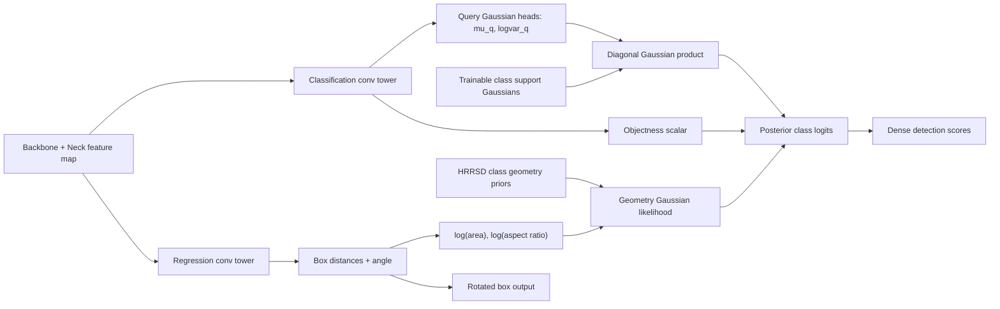

# HRRSD SGP-Head / Gaussian Product Posterior Head Design

## Decision

Use **SGP-Head (Support Gaussian Product Posterior Head)** as the new OpenRSD branch for HRRSD smoke testing. The target dataset, split, priors, and evaluation family are the same as P10/P11:

- Dataset root: `/data1/zcy/datasets/HRRSD_800_0/internal_split_20260619/`
- Train labels: `train/labelTxt/`
- Val labels: `val/annfiles/`
- Geometry priors: `work_dirs/gs3c_dataset_inventory_20260619/hrrsd_internal_train_geometry_priors.csv`
- Baseline family config: `M_configs/Diagnostics/hrrsd_rtmdet_l_dota_init_internal_epoch3_gpu0189.py`

The design intentionally bypasses OpenRSD-style multi-layer support fusion. It does not use the current `support -> fusion layers -> rtm_cls` detection-head path.

## Problem

The current OpenRSD head route is still structurally close to the original OpenRSD detection head:

1. Build support rows.
2. Fuse support/query features through multiple fusion/cross-attention layers.
3. Feed a modified classification tower.

That is useful for incremental tuning, but it is not a sufficiently different hypothesis. We need a new support fusion and detection-head output paradigm that can smoke-test quickly on HRRSD and plausibly match the 3-epoch RTMDet-L baseline mAP.

## Core Idea

Replace explicit support feature fusion with a probabilistic posterior scoring head:

1. Each dense query location predicts a diagonal Gaussian:
   `q(x) = N(mu_q(x), sigma_q(x)^2)`.
2. Each class owns a trainable support Gaussian:
   `s_c = N(mu_c, sigma_c^2)`.
3. The class logit is the closed-form diagonal Gaussian product score:
   `logit_sem(c, x) = -0.5 * mean_d((mu_q - mu_c)^2 / (sigma_q^2 + sigma_c^2) + log(sigma_q^2 + sigma_c^2))`.
4. The regression branch predicts box distances as usual. Those distances produce geometry features:
   `g(x) = [log(area), log(aspect_ratio)]`.
5. HRRSD class geometry priors add a second Gaussian likelihood:
   `logit_geo(c, x) = log N(g(x); mu_g,c, sigma_g,c^2)`.
6. The final class score is:
   `score(c, x) = scale * (w_sem * logit_sem + w_geo * logit_geo + w_obj * objectness + bias_c)`.

This is a product-posterior decision rule, not a support-fusion feature stack.

## Detection-Head Flow

## Why This Is 100% Different From OpenRSD Fusion

- There is no support image/row cross-attention in the classification path.
- There are no OpenRSD fusion layers in the new head.
- Support is represented as class-level Gaussian parameters, not as token features.
- The head output itself is a probabilistic posterior score, not a linear class convolution.
- Geometry priors enter the class logit directly, after box-distance prediction, instead of acting as a loss-only regularizer.

## HRRSD Smoke Gate

Primary smoke target:

- The model must train and evaluate for 3 epochs on the HRRSD internal split.
- It should approach or exceed the HRRSD epoch-3 RTMDet-L baseline mAP around `0.8307`.

Secondary comparison:

- Compare against the P10/P11 family using the same HRRSD split and risk tools.
- If the smoke result clears baseline and class-risk profile is not obviously worse, draw the final flow diagram and keep the line alive for ablation.

## Minimum Ablations

1. `SGP-sem`: semantic Gaussian product only, `geometry_weight=0`.
2. `SGP-sem+geo`: add HRRSD geometry-prior likelihood.
3. `SGP-cal`: tune logit scale and geometry weight if smoke is unstable.

## Implementation Scope

Files:

- `M_AD/models/dense_heads/sgp_rtmdet_head.py`
- `tests/test_sgp_rtmdet_head.py`
- `M_configs/Diagnostics/hrrsd_rtmdet_l_dota_init_internal_sgp_head_train_gpu67.py`
- `M_configs/Diagnostics/hrrsd_rtmdet_l_dota_init_internal_sgp_head_eval_gpu67.py`
- `M_Tools/experiments/run_hrrsd_sgp_head_train_20260622.sh`

This branch should avoid touching the existing OpenRSD fusion head unless a registry/import issue makes a narrow import hook necessary.
