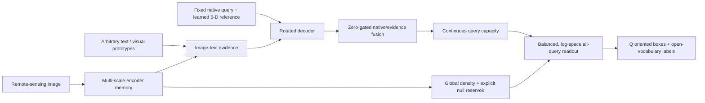

# OV-CapFlow 后续研究与实验执行指南

生成日期：2026-07-14（Asia/Shanghai）  
适用仓库：`/data1/zcy/OV-CapFlow`  
默认设备：physical GPUs `4,5,6,7`  
文档状态：下一阶段工作基线；任何中长训都必须先通过本文 gate

## 0. 一页执行结论

下一阶段的正确顺序不是立即跑 20E/40E，而是：

1. 冻结并提交当前 OV-CapFlow strict substrate；
2. 完成真实单 batch forward/backward 和 checkpoint mapping；
3. 在同一代码、同一 mouth 上复现公开 parent；
4. 实现并验证 balanced reduction、显式 null reservoir、stable log-space readout；
5. 用 GPU4–7 做单变量短程因果矩阵；
6. 只有当 AP、empty/null、gate ordering 和 projection condition 同时过门，才做 3 seeds 与 E7/E10；
7. 只有 3 seeds 稳定后，才允许进入更长 schedule 和真正的 base/novel 开放词汇评测。

当前最优先结构组合是：

> **fixed native queries + query-preserving transported evidence + balanced positive/negative supervision + explicit null reservoir + continuous density capacity + stable log-space all-query readout**

其中 balanced 与 null 是下一轮必须项；density 是受控因素，不是默认必加项；identity 是默认初始化，orthogonal 是第二对照；任何 query_aux 只允许低权重/退火，禁止再次使用固定 `0.5`。

## 1. North Star 与硬约束

### 1.1 研究目标

构建一个公开可复现的端到端开放词汇遥感旋转检测器：

- query 数固定且直接进入 decoder；
- query content 与 5-D rotated reference 是 learned parameters；
- 每个 query 直接输出一个 OBB 与一个开放词汇类别；
- query 自身语义不被 image evidence 覆盖；
- scene density / instance capacity 是连续量，不转成 survivor mask；
- raw-patch inference 无 encoder proposal top-k、无 global query-class top-k、无 dense detection head、无 NMS；
- 标准 DOTA crop merge 必须作为单独口径报告，不得冒充 strict raw inference。

### 1.2 暂不解除的约束

| Constraint | Decision | Reason |
|---|---|---|
| fixed matching queries | keep | 这是 strict set prediction 的核心合同 |
| no NMS / rotated NMS | keep | 避免用后处理掩盖 ownership 与 calibration 失败 |
| no dense inference head | keep | 论文差异化与 E2E 合同 |
| no encoder proposal top-k | keep for primary line | OV-CapFlow 的关键 substrate 差异 |
| no global survivor top-k | keep | capacity 必须通过连续 null/existence 表达 |
| direct rotated boxes | keep | 不使用 `minAreaRect` 后处理 |
| no teacher/pseudo in first causal stage | keep | P133 已证明低阈值 pseudo route 高风险 |

### 1.3 可以保留的训练期工具

- DINO denoising queries；
- Hungarian matching；
- training-only one-to-many / dense auxiliary supervision，但必须 default-off、单独消融、推理图完全不可达；
- frozen parent checkpoint / backbone initialization；
- base-class labels；
- 只用于诊断、不改变最终预测集合的 score threshold、rotated IoU 与 per-class statistics。

训练期允许不等于论文主线必须使用。当前第一优先仍是把 balanced/null/capacity 在干净 strict substrate 上测清楚。

## 2. 建议框架：OV-CapFlow v1



### 2.1 Fixed Native Query State

每个 matching slot 持有：

- persistent content `q_native`；
- learned normalized rotated reference `(cx, cy, w, h, angle)`；
- 不依赖 encoder token ranking 的初始身份。

第一版只允许低差异网格初始化和可学习参数。Query count 可以通过 config 改变，但同一实验矩阵内必须固定，禁止根据图像在推理期动态裁剪。

### 2.2 Query-Preserving Evidence Fusion

根据 HRSC Experiment 4 的实测修正，主线应保持 transported parent path，
只学习 native query 相对父路径的有界残差：

```text
native_residual = q_native - q_parent
q_fused = q_parent + tanh(g(q_native, q_parent)) * P(native_residual)
```

约束：

- `P` 默认 identity；orthogonal 仅作同口径对照；
- gate 最初严格为 0，首个 forward 精确恢复 `q_parent`；
- `c_q∈(0,1)` 尚未进入 Experiment 4/5 的已验证结构，只允许在
  parent-preserving fusion 完成多 seed 复现后作为单变量缩放项加入，且不删除 query；
- DN prefix 不参与该 persistent-native 合同；
- 任何 evidence-only replacement 都不进入主矩阵。

### 2.3 Balanced Supervision

R29 已证明 query-average reduction 会被 unmatched 数量支配。OV-CapFlow 必须显式拆分：

- matched query loss mean；
- unmatched query loss mean；
- empty-tile loss mean；
- 再用预先固定权重组合，而不是对全部 Q 直接求均值。

第一版建议使用等权正/负 group mean，具体数值写入 config 并记录 effective counts。禁止在结果出来后通过样本数偷偷改变 reduction。

### 2.4 Explicit Null Reservoir

Null 不是普通背景 class 的别名，而是容量出口。第一版应同时实现：

1. query-level null probability；
2. empty-tile foreground mass penalty；
3. matched-vs-unmatched gate ordering；
4. scene-level null capacity / count residual；
5. absent-prompt false-positive statistics。

建议目标方向：

- matched query 的 evidence gate 不低于 unmatched query；
- empty tile 的 `sum(non_null_score)` 随训练不增长；
- `sum(capacity)` 与 GT count 保持同尺度；
- global density `N_hat` 不依赖 padding token。

这些是软目标，不允许在推理中变成 hard mask。

### 2.5 Continuous Density Capacity

保留当前 per-query `c_i∈(0,1)` 和 global `N_hat`。Density 是否进入 canonical 由实验决定：

- 若 overall mAP 提升 `>=0.002`，直接晋级；
- 或 overall 回退 `<=0.001`，同时 count MAE、dense-class duplicate 和 rare-class recall 中至少两项明显改善，进入待验证；
- 否则停止当前参数点，但保留机制实现。

禁止在 null calibration 完成前做 density-strength 大扫参。

### 2.6 Stable Log-Space Readout

R29 power replay 暴露 `exp -> underflow -> class-0 tie`。最终类别选择必须：

- 在 log-space 比较类别；
- class-common temperature/power 不改变 label argmax；
- 记录 requested/effective temperature 和 power；
- 在 fp16 极端 logits 下保持 finite；
- 输出全部 Q 个 query，不做 global top-k。

推荐把 label selection 与 score calibration 分开：先从稳定 log posterior 选 label，再将 null/capacity 转成单 query score。

### 2.7 Rotated Geometry

第一版继续使用 RHINO direct 5-D refinement 与现有 KLD/Gaussian matching，先避免同时更换几何定义。等 semantic/null 主轴过门后，才做：

- KLD/GWD vs Hausdorff/Chamfer matching；
- doubled-angle periodic representation；
- scale/angle bucket diagnostics；
- square-like ambiguity 与 local duplicate 分析。

## 3. 两条工作线，禁止混跑

### 3.1 Track A：最小可行 OV-CapFlow

目标：在公开 CastDet/RHINO substrate 上复现 R25/R29 的因果链。

只包含：fixed query、native/evidence fusion、balanced reduction、null reservoir、continuous capacity、stable readout。

这是近期唯一允许进入 DOTA2 短训与多 seed 的主线。

### 3.2 Track B：Shared-Marginal / Unified Transport Research

目标：验证 shared query capacity 是否比 factorized branches 更好地统一视觉、语义、null 和 pose。

Track B 只有在 Track A parent replay 和 balanced/null 因果矩阵成立后启动。首个对照必须是 parameter-matched no-shared，而不是继续叠加 memory、graph、capsule、diffusion 或多个 loss。

如果 no-shared 在 AP、ownership、duplicates、null calibration 和 novel H-mean 上均不劣于 shared，核心 shared-marginal 主张应被证伪，不得靠命名或额外模块挽救。

## 4. Stage Gates

### 4.1 G0：代码与真实 batch gate

#### 必做

- 将当前新增文件形成可追溯 commit；
- 运行 17 个现有测试；
- 加入真实 dataset pipeline 的单 batch forward；
- 加入真实 GT 的 loss backward；
- 检查每项新增 loss 非恒零、finite、有梯度；
- 保存一份模型参数/梯度/输出 shape audit；
- 扫描生产推理 path 的 top-k/NMS/dense-head/minAreaRect；
- 固定 environment lock 与 upstream commit。

#### Pass

- loss、gradient、box、capacity、count、gate 全 finite；
- matching 输出严格为 Q 行；
- DN prefix 与 matching suffix 数量正确；
- 默认关闭新模块时与 parent path 张量级一致；
- strict audit 全部通过。

#### Fail action

任何 G0 失败都是工程问题，不得记作结构负结果；修复后重新跑 G0，不启动 GPU 矩阵。

### 4.2 G1：Parent Replay 与 Mouth Gate

#### 必做

建立三类 baseline：

1. upstream Oriented GroundingDINO / CastDet original inference；
2. OV-CapFlow fixed-query strict native-only；
3. 若 checkpoint 兼容，历史 P134B/OpenSetFlow replay 只作外部参照，不混入同代码 delta。

#### Pass

- 同 checkpoint、同 evaluator 的 parent replay 在重复运行中 `|delta mAP|<=0.001`；
- raw13833 明确为 `13,833` images、18 classes、`filter_empty_gt=False`；
- paper-mouth 作为另一个 config 和结果目录；
- prediction count、class order、angle convention、crop IDs 全审计通过。

#### Fail action

Parent replay 不一致时停止所有结构解释，先修 evaluator、checkpoint mapping 或 dataset mouth。

### 4.3 G2：Single-Variable Causal Gate（3E 或等价短程）

推荐 GPU4–7 首轮矩阵：

| GPU | Exp ID | Variant | Isolated question |
|---:|---|---|---|
| 4 | `OVC-C0` | strict native-only | fixed-query substrate 本身的下限 |
| 5 | `OVC-C1` | identity fusion, unbalanced, no density | query-preserving evidence 是否有益 |
| 6 | `OVC-C2` | identity fusion + balanced, no density | balanced 是否复现 R29 因果收益 |
| 7 | `OVC-C3` | identity fusion + balanced + density | density 在校准后是否产生净增益 |

统一要求：同 parent、seed、Q、batch budget、LR、epochs、augmentation、prompt bank、val mouth。

#### Recommended promotion gates

| Comparison | Promote | Park | Stop exact recipe |
|---|---|---|---|
| C1 vs C0 | `mAP +0.003` or better calibration with `mAP drop<=0.001` | positive trend but under gate | `mAP drop>0.010` and no mediator gain |
| C2 vs C1 | `mAP +0.005`, at least 12/18 classes non-negative, empty/gate both improve | one AP or two mediator gains | `mAP drop>0.005` or gate gap worsens |
| C3 vs C2 | `mAP +0.002` or drop `<=0.001` plus two capacity metrics improve | mechanism-only | drop `>0.001` without rare/dense gain |

这些是下一阶段建议 gate，必须在运行前写进 config/report，不得事后改变。

### 4.4 G3：Null / Initialization / Stable Readout Gate

只对 G2 最好结构做第二轮：

| GPU | Exp ID | Variant | Purpose |
|---:|---|---|---|
| 4 | `OVC-N0` | G2 winner, no explicit null reservoir | matched control |
| 5 | `OVC-N1` | + explicit null reservoir | empty/null causal test |
| 6 | `OVC-N2` | N1 + orthogonal adapter | conditioning counterfactual |
| 7 | `OVC-N3` | N1 + stable power replay | verify label-invariant calibration |

Null reservoir 晋级建议：

- overall `mAP +0.003`；或
- mAP 回退不超过 `0.001`，empty foreground mass/empty FP 至少降低 `20%`，gate gap 至少降低 `20%`，且 non-empty recall 不下降超过 `0.005`。

Orthogonal 只有在 condition number 明显改善且 AP/calibration 不退时才替代 identity；否则继续作为诊断对照。

### 4.5 G4：3 Seeds + E7/E10 Gate

只有 G2/G3 winner 可进入。建议 seeds 至少三个，保存每个 epoch raw full-val 与 calibration JSON。

#### Pass to medium/long training

- mean delta vs matched control `>=+0.005 mAP`；
- 没有 seed 低于 control 超过 `0.003`；
- seed std `<=0.005`；
- E3→E7 empty mass 不持续单调恶化；
- unmatched gate 不持续高于 matched gate；
- projection condition number 无数量级爆炸，或爆炸与 AP/校准有明确可控关系；
- 至少 12/18 classes 非负，container-crane/helipad 不再长期双零是加分项但非单独 pass 条件。

#### Stop

- 三个 seed 都只在 E3/E4 短峰，之后 calibration 持续恶化；
- mean gain `<0.002` 且 mechanism 指标无一致改善；
- 任一 seed 出现类别塌缩、非有限或输出合同破坏；
- 只能通过挑选单个 checkpoint 得到正结论。

### 4.6 G5：Open-Vocabulary Gate

DOTA2 全 18 类训练只能证明多类旋转检测与 open-prompt compatibility，不能单独证明 novel transfer。真正开放词汇评测必须固定：

- base/novel class split；
- train annotations 只包含 base 类监督；
- immutable text/visual prompt bank；
- absent prompt set；
- class name、synonym、template 与 negative prompt 版本；
- label leakage audit。

建议先使用仓库已有 VisDroneZSD / CastDet protocol 复现公开 OV baseline，再建立 DOTA2 或 HRRSD 的 deterministic frequency-stratified split。

#### Primary metrics

- base AP；
- novel AP；
- harmonic mean；
- absent-prompt FPR；
- generalized setting overall AP；
- per-scale/per-angle novel recall；
- closed-set regression；
- raw all-query latency/memory。

只有 novel AP/H-mean 优于 matched public baseline，且不依赖 novel labels、teacher pseudo、NMS 或 dense inference head，才允许进入论文开放词汇主张。

## 5. 必报指标与诊断 JSON

每次 validation 必须同时落盘 machine-readable JSON，不得只保留日志文本。

### 5.1 Primary detection

- `mAP`, `AP50`, `AP75`（若 evaluator 支持）；
- 18-class AP/recall/detection count；
- raw13833 image count 与 class order；
- paper6605 单独报告；
- best 与 final checkpoint 都报告。

### 5.2 Strict inference audit

- `num_matching_queries`；
- `predictions_per_image`；
- `uses_encoder_proposal_topk`；
- `uses_global_query_class_topk`；
- `uses_survivor_topk`；
- `uses_dense_inference_head`；
- `uses_nms`；
- `uses_min_area_rect`。

除 `num_matching_queries/predictions_per_image` 外，其余布尔项必须为 false。

### 5.3 Empty / null / gate

- empty image count；
- mean/sum foreground score mass per empty tile；
- score-curve FP statistics（诊断阈值不改变预测）；
- query/fused binary Brier；
- null ECE；
- matched gate mean；
- unmatched gate mean；
- `gate_gap = unmatched - matched`；
- airport prediction share 与 airport recall。

### 5.4 Capacity / density / ownership

- `sum(capacity)` mean/std；
- count MAE / relative count error；
- empty capacity mass；
- matched/unmatched capacity mean；
- GT coverage；
- duplicate extras/GT；
- local winner margin；
- dense-class detections/GT；
- small/medium/large ownership recall；
- angle bucket recall。

### 5.5 Numerical / optimization

- projection singular-value range 和 condition number；
- gate/null/capacity gradient norm；
- main-loss : auxiliary-loss gradient ratio；
- non-finite count；
- effective LR；
- requested/effective power/temperature；
- peak memory、iteration time、validation time。

## 6. 数据与口径实施规范

### 6.1 DOTA2 structural benchmark

固定：

- train `ss_train=47,294`；
- raw val `ss_val=13,833`；
- `filter_empty_gt=False`；
- 18 classes；
- fixed Q；
- dynamic DN query-budget sampler；
- raw all-query output；
- standard crop merge 另行输出到不同目录。

任何 dataset length、class order 或 filter 改变都必须产生新的 mouth ID，不能覆盖旧结果。

### 6.2 Dynamic batch safety

不再使用未经全数据审计的固定 batch24。Sampler 必须：

- 保持全样本一次且仅一次覆盖；
- 保存每个 update 的 actual batch size / DN query count；
- 不根据类别或 loss 选择样本；
- 不改变 optimizer effective sample count；
- 记录 minimum batch 与缩小次数；
- 四个对照使用同一 sampler ordering。

### 6.3 Open-vocabulary protocol

在任何 base/novel 训练前，生成并提交：

- `split.json`；
- `class_names.json`；
- `prompt_bank.json`；
- `negative_prompts.json`；
- training annotation leakage audit；
- evaluation class mapping test。

这些 artifact 一旦用于首个正式 run，不得根据 validation AP 修改。

## 7. 实验记录与目录规范

每个实验使用独立目录：

```text
resultmd/exp_<exp_id>_<short_name>/
  fplan_<exp_id>.md
  flog_<exp_id>.md
  fres_<exp_id>.md
  faudit_<exp_id>.md
  metrics_<epoch>.json
  calibration_<epoch>.json
```

`work_dirs/` 使用同一个 `exp_id`。每份 final report 至少写明：

- commit；
- config；
- parent checkpoint + SHA256；
- seed；
- GPUs；
- mouth；
- Q / batch / sampler；
- start/end time；
- best/final metric；
- per-class；
- mediator；
- strict audit；
- promote/park/stop；
- 精确丢弃边界与复活条件。

任何运行必须在启动前提交代码；禁止用 dirty/untracked 代码做正式对照。

## 8. 结果判定规则

### 8.1 Invalid as science

以下只能标记 `invalid-engineering`：

- loss 没进入 forward/backward；
- checkpoint load 覆盖了 intervention；
- eval mouth 错误；
- class mapping 错误；
- OOM/NaN 在有效优化前发生；
- strict audit 失败；
- launcher 未覆盖完整数据；
- prediction/evaluator 文件不完整。

修复后必须原样重跑，不能用 invalid 结果支持或反对结构。

### 8.2 Valid negative

只有以下条件同时满足，才允许停止精确配方：

1. intervention 真实生效；
2. parent、mouth、seed、budget 可比；
3. 完成预注册 gate；
4. 主要指标与目标 mediator 都无收益，或出现可重复灾难性回退；
5. 报告限定到具体拓扑、权重和插入点。

### 8.3 Park, not dead

以下情况使用 `park`：

- AP 低于 gate，但 mediator 明确改善；
- 只有单 seed；
- 只在 HRSC 单类验证；
- 机制可能依赖尚未完成的 null/base-novel protocol；
- 当前配方被更强结构支配，但存在清晰复活条件。

### 8.4 Assumption review

同一个根因轴出现三个连续、有效、匹配的结构负结果后，暂停该轴，回到：

- parent replay；
- data mouth；
- query state 可观测性；
- loss gradient ratio；
- literature/prior-art；
- claim 是否应缩小。

禁止用第四个更复杂组合逃避复盘。

## 9. AP 目标阶梯

不要直接把 raw DOTA2 AP70 当作下一次 run 的 pass/fail。建议分层：

| Milestone | Meaning |
|---|---|
| reproduce public parent | 工程与 evaluator 可信 |
| strict fixed-query reaches parent neighborhood | strict substrate 不再灾难性回退 |
| raw13833 `>=0.50` | 脱离历史 strict 0.40 平台 |
| raw13833 `>=0.60` | 形成论文级结构候选 |
| raw13833 `>=0.660225` | 追平既有 dense scaffold baseline |
| raw13833 `>=0.675` | 强 raw benchmark result |
| raw13833 `>=0.70` | 高风险长期目标，不作近期承诺 |

真正论文价值还需要 novel AP/H-mean、strict audit、效率和机制证据，单独 raw AP 高并不自动构成开放词汇论文。

## 10. 近期明确禁止事项

- 不直接从当前未实跑代码启动 20E/40E；
- 不继续扫 query count、top-k、density strength 作为主线；
- 不把 current R25 fixed-LR continuation 复制到新仓库；
- 不再用 query_aux `0.5`；
- 不做 evidence-only semantic replacement；
- 不用低阈值 teacher detections 当 positive pseudo labels；
- 不用 filtered paper-mouth 掩盖 raw empty FP；
- 不把设计文档数量当实验数量；
- 不用单 seed 单峰 checkpoint 宣布晋级；
- 不在 stable log-space readout 前解释 power/temperature 的类别收益；
- 不在 DOTA2 all-class training 上宣称 novel-class open vocabulary。

## 11. 未来 72 小时建议顺序

### Day 1：工程闭环

1. 保存当前 diff 与 upstream provenance；
2. 把 17 tests 作为 pre-commit gate；
3. 新增 real-batch dataset/model test；
4. 检查 current capacity/count loss 是否真实接入训练；
5. 设计 balanced reduction 与 explicit null reservoir 的失败测试；
6. 实现 stable log-space per-query selection；
7. 形成第一个可追溯 commit。

交付物：G0 audit、commit hash、real-batch log、strict scan。

### Day 2：Baseline 与 evaluator

1. 建立 DOTA2 raw13833 config；
2. 固定 18-class order、angle convention、dataset length；
3. 完成 parent checkpoint mapping/replay；
4. 保存 parent predictions 与 SHA256；
5. 建立每 epoch calibration JSON；
6. 验证 dynamic DN budget sampler。

交付物：G1 parent report、mouth audit、calibration schema。

### Day 3：GPU4–7 短程矩阵

按 `OVC-C0..C3` 启动第一轮。先跑一个小 smoke checkpoint；四臂都通过 finite/strict/sampler gate 后，再进入预注册 3E。结束后只根据同 mouth、同 seed、同 budget 的 AP + mediator 做决定。

交付物：四臂 final report、per-class table、empty/gate/capacity table、promote/park/stop。

## 12. 中期实验路线

### Phase 1：Structural viability

- DOTA2 all-18 raw13833；
- C0/C1/C2/C3；
- identity default；
- no teacher；
- no long train。

### Phase 2：Calibration and reproducibility

- explicit null；
- orthogonal counterfactual；
- stable power replay；
- 3 seeds；
- E7/E10 with early stopping。

### Phase 3：True open vocabulary

- reproduce CastDet VisDroneZSD；
- immutable base/novel split；
- prompt/template ablation；
- absent-prompt FPR；
- novel H-mean；
- DOTA2/HRRSD second protocol。

### Phase 4：Paper-scale validation

- DOTA2 raw + standard merge；
- at least one additional OV remote-sensing dataset；
- HRSC rotation/ownership diagnosis；
- public baselines；
- 3 seeds；
- params/FLOPs/latency/memory；
- failure cases and calibration plots。

## 13. 论文实验包

### 13.1 Required baselines

- upstream CastDet / Oriented GroundingDINO；
- fixed learned query/reference only；
- native query only；
- evidence-only replacement（负对照，不作主线）；
- R25-style query-preserving fusion；
- unbalanced vs balanced reduction；
- no-null vs explicit null reservoir；
- no-density vs continuous density；
- identity vs orthogonal；
- parent global top-k vs strict all-query readout；
- KLD/GWD vs one rotation-aware alternative；
- parameter-matched no-shared if Track B 启动。

### 13.2 Required tables

1. Main base/novel AP and H-mean；
2. DOTA2 raw13833 all-class table；
3. strict inference audit；
4. query ownership / duplicate / count calibration；
5. empty tile and absent prompt；
6. initialization / reduction / null / density ablation；
7. speed / memory / params；
8. three-seed mean/std；
9. per-scale/per-angle/per-density breakdown；
10. failure cases。

### 13.3 Claim gate

论文主 claim 只围绕一条因果链：

> preserving query identity + balanced evidence capacity + explicit null → better ownership/calibration → better strict open-vocabulary oriented set prediction

如果实验只支持 AP、不支持 ownership/null；或只支持 calibration、不支持 novel AP，就必须缩小 claim。

## 14. 风险清单

| Risk | Symptom | Guard |
|---|---|---|
| mouth confusion | 0.705 与 0.660/0.370 混报 | 每份报告第一表写 image count/filter |
| checkpoint intervention overwrite | requested != effective | load 后重新应用并序列化 effective config |
| class-0 underflow bias | airport share 异常 | log-space selection + label invariance test |
| unmatched domination | gate unmatched > matched | balanced group mean + per-group gradients |
| projection ill-conditioning | condition number 数量级上升 | every-epoch SVD audit + early stop |
| dense-scene OOM | batch24 在稠密图崩溃 | DN budget sampler + full-dataset preflight |
| semantic overwrite | R24/R19 类别塌缩 | zero-gated native residual |
| density overuse | evidence/null calibration 变差 | density 只在 balanced/null 后单变量加入 |
| rare-class zero AP | container-crane/helipad 长期为 0 | class-capacity and prompt diagnostics |
| open-vocab leakage | novel label/prompt 被训练读取 | immutable split and annotation audit |
| dirty formal run | 结果不可复现 | commit before launch，保存 SHA256 |
| licensing | RHINO CC BY-NC | academic/non-commercial treatment |
| novelty overlap | broad “first” 被 prior art 否定 | final literature refresh and narrow claim |

## 15. 完成定义

下一阶段只有同时达到以下条件，才算“真正可行框架候选”而不是又一轮局部实验：

1. public repo 中可从 clean checkout 构建；
2. parent replay 与 strict mouth 可重复；
3. fixed all-query、no top-k/NMS/dense inference audit 通过；
4. DOTA2 raw13833 在 3 seeds 上稳定优于 matched strict control；
5. empty/null/gate/capacity 至少三项机制指标与 AP 同向；
6. E7/E10 不出现已知 calibration drift；
7. base/novel H-mean 优于公开 matched baseline；
8. 结果不依赖单次 peak、oracle policy、validation-tuned router 或 novel labels；
9. 训练与评测 artifacts、commit、config、checkpoint hash 完整；
10. 新颖性主张经过投稿前文献刷新。

在这些条件前，正确措辞是“candidate substrate / causal signal / promoted hypothesis”；达到后，才可以称为“论文级框架候选”。

## 16. 关联文档

- 两周完整复盘：`docs/project_history/exp_20260714_two_week_review/fres_20260701_20260714_full_review_zh.md`
- OV-CapFlow architecture：`docs/superpowers/specs/2026-07-14-ov-capflow-design.md`
- strict substrate plan：`docs/superpowers/plans/2026-07-14-ov-capflow-strict-substrate.md`
- semantic-capacity plan：`docs/superpowers/plans/2026-07-14-ov-capflow-semantic-capacity.md`

本指南优先级高于“直接长训”的临时冲动；若新证据推翻其中假设，应先更新本文的事实、gate 与失败边界，再启动下一轮正式实验。
